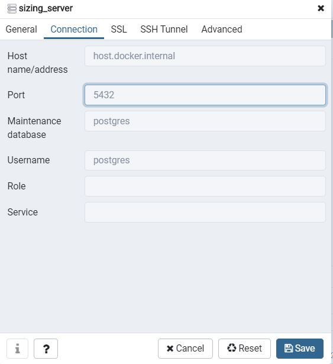

## Pré-requis
- docker
- nodejs
- java

## Démarrer l'application
- Initialisation de la bdd
```bash
docker-compose build &&
docker-compose up -d postgres_container && 
docker-compose up -d pgadmin_container
```

- Insérer quelques infos via pg admin (mdp : changeme)  
Créer un serveur


Créer une database nommée sizing_db  

- Démarrer le serveur situé dans [Back-End](./Back-End)
- Enfin insérer ses quelques données dans la table item créé via le lancement du serveur :  
INSERT INTO	item (name, description, "imageUrl", size, weight, "wikiUrl")
VALUES 	('human', 'Humans (Homo sapiens) are a species of highly intelligent primates.', 'https://i.pinimg.com/736x/83/6a/9b/836a9b18adaa21e843116bfde0cba594.jpg', 175, 68, 'https://en.wikipedia.org/wiki/Human'),
		('dog', 'The dog (Canis familiaris when considered a distinct species or Canis lupus familiaris when considered a subspecies of the wolf) is a domesticated carnivore of the family Canidae.', 'https://www.canalvie.com/polopoly_fs/1.1422594.1524076568!/image/bebe-labrador.jpg_gen/derivatives/cvlandscape_670_377/bebe-labrador.jpg', 40, 6, 'https://en.wikipedia.org/wiki/Dog'),
		('elephant', 'Elephants are mammals of the family Elephantidae and the largest existing land animals.', 'https://static.lexpress.fr/medias_12075/w_2048,h_1146,c_crop,x_0,y_31/w_1000,h_563,c_fill,g_north/v1571763645/un-elephant-dans-la-savane-illustration_6182458.jpg', 360, 1200, 'https://en.wikipedia.org/wiki/Elephant');

- Démarrer le front situé dans [front-end](./front-end)
```bash
npm i && npm start
```

- Enfin allez sur http://localhost:4200

